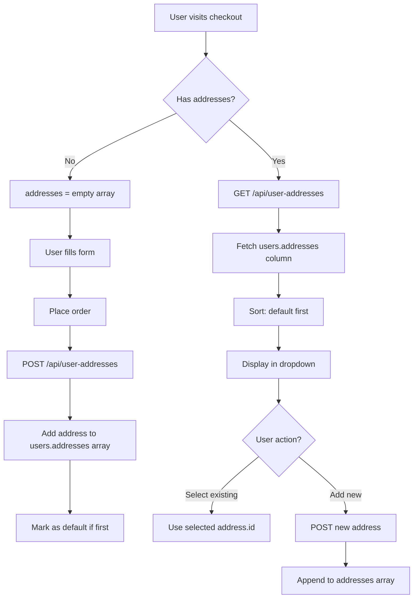

# 📍 Address Storage in Users Table - Implementation Guide

## ✅ Implementation Overview

Addresses are now stored directly in the **`users` table** in an **`addresses` column** as a **JSONB array**, instead of using a separate `user_addresses` table.

---

## 🗄️ Database Structure

### Users Table Schema
```sql
-- New column added to public.users table
ALTER TABLE public.users
ADD COLUMN addresses JSONB DEFAULT '[]'::jsonb;
```

### Address Array Format
```json
[
  {
    "id": "uuid-1",
    "full_name": "John Doe",
    "phone": "9876543210",
    "email": "john@example.com",
    "address": "123 Main Street",
    "city": "Chennai",
    "district": "Chennai",
    "pin_code": "600001",
    "is_default": true,
    "created_at": "2025-12-18T10:30:00Z"
  },
  {
    "id": "uuid-2",
    "full_name": "John Doe",
    "phone": "9876543210",
    "address": "456 Office Park",
    "city": "Coimbatore",
    "district": "Coimbatore",
    "pin_code": "641001",
    "is_default": false,
    "created_at": "2025-12-18T11:00:00Z"
  }
]
```

---

## 🚀 Setup Instructions

### Step 1: Run Database Migration
```bash
# Run this in Supabase SQL Editor
```
Execute [add-addresses-array-to-users.sql](add-addresses-array-to-users.sql)

This will:
- Add `addresses` JSONB column to `users` table
- Set default value to empty array `[]`
- Create GIN index for fast queries

### Step 2: Verify Setup
```sql
-- Check column exists
SELECT column_name, data_type
FROM information_schema.columns
WHERE table_name = 'users'
AND column_name = 'addresses';

-- View current data
SELECT id, email, addresses
FROM public.users
LIMIT 5;
```

---

## 📁 Implementation Files

### 1. API Endpoint: `/api/user-addresses`
**File**: [src/app/api/user-addresses/route.ts](src/app/api/user-addresses/route.ts)

**Methods**:
- `GET` - Fetch all addresses for logged-in user
- `POST` - Add new address to array
- `PATCH` - Update existing address in array
- `DELETE` - Remove address from array

**Key Features**:
- Automatic UUID generation for each address
- Smart default address management (only 1 default per user)
- Sorted response (default first, then by creation date)
- First address auto-set as default

### 2. Frontend: Checkout Page
**File**: [src/app/checkout/page.tsx](src/app/checkout/page.tsx)

**Changes**:
- Line 57: API call to `/api/user-addresses` (instead of `/api/addresses`)
- Line 78: Console log updated to show "users.addresses column"
- Line 268: POST to `/api/user-addresses` for new address
- Line 286: Console log shows "users.addresses array"

---

## 🔄 How It Works

### Address Lifecycle



### First Order Flow
```
1. User enters checkout → addresses = []
2. Fill shipping form manually
3. Click "Place Order"
4. API: POST /api/user-addresses
   → Adds address to users.addresses array
   → Sets is_default = true (first address)
5. Order created with address_id
6. Next visit: addresses array has 1 item
```

### Subsequent Orders Flow
```
1. User enters checkout
2. API: GET /api/user-addresses
   → Returns users.addresses array
3. Dropdown shows all addresses
4. Default address pre-selected
5. User selects existing OR adds new
6. Order created with selected/new address_id
```

---

## 🎯 API Endpoints

### GET `/api/user-addresses`
Fetches all addresses from `users.addresses` column

**Response**:
```json
{
  "addresses": [
    {
      "id": "uuid",
      "full_name": "John Doe",
      "phone": "9876543210",
      "email": "john@example.com",
      "address": "123 Main St",
      "city": "Chennai",
      "district": "Chennai",
      "pin_code": "600001",
      "is_default": true,
      "created_at": "2025-12-18T10:30:00Z"
    }
  ]
}
```

### POST `/api/user-addresses`
Adds new address to the array

**Request**:
```json
{
  "full_name": "John Doe",
  "phone": "9876543210",
  "email": "john@example.com",
  "address": "456 Park Ave",
  "city": "Coimbatore",
  "district": "Coimbatore",
  "pin_code": "641001",
  "is_default": false
}
```

**Response**:
```json
{
  "address": { ...new address with generated UUID },
  "addresses": [ ...all addresses including new one ]
}
```

**Logic**:
1. Generates UUID for address
2. If `is_default = true`, unsets all other defaults
3. If first address, auto-sets as default
4. Appends to existing addresses array
5. Updates `users.addresses` column

### PATCH `/api/user-addresses`
Updates existing address in array

**Request**:
```json
{
  "id": "address-uuid",
  "full_name": "Updated Name",
  "is_default": true
}
```

**Logic**:
1. Finds address by ID in array
2. Updates specified fields
3. If setting as default, unsets others
4. Replaces address in array
5. Updates `users.addresses` column

### DELETE `/api/user-addresses?id=uuid`
Removes address from array

**Logic**:
1. Filters out address by ID
2. If deleted address was default, makes first remaining address default
3. Updates `users.addresses` column

---

## 🧪 Testing Guide

### Test 1: First-Time User
```bash
# 1. Login as new user
# 2. Check database
SELECT addresses FROM users WHERE id = 'user-id';
# Expected: []

# 3. Go to checkout, fill form, place order
# 4. Check database again
SELECT addresses FROM users WHERE id = 'user-id';
# Expected: [{ ...address with is_default: true }]

# 5. Return to checkout
# Expected: Dropdown appears with saved address
```

### Test 2: Multiple Addresses
```bash
# 1. Add 2nd address via "+ Add New Address"
# 2. Check database
SELECT jsonb_array_length(addresses) as count FROM users WHERE id = 'user-id';
# Expected: 2

# 3. Check default count
SELECT addresses
FROM users
WHERE id = 'user-id'
AND addresses @> '[{"is_default": true}]'::jsonb;
# Expected: 1 row (only 1 default)

# 4. Verify both show in dropdown
# Expected: Dropdown has 2 addresses + "Add New"
```

### Test 3: Default Address Logic
```sql
-- Manually set 2nd address as default
UPDATE users
SET addresses = jsonb_set(
  jsonb_set(addresses, '{0,is_default}', 'false'),
  '{1,is_default}', 'true'
)
WHERE id = 'user-id';

-- Verify in checkout
-- Expected: 2nd address pre-selected
```

---

## 💾 Database Queries

### View User Addresses
```sql
-- Current user (run as authenticated)
SELECT addresses FROM users WHERE id = auth.uid();

-- Specific user (run as admin)
SELECT email, addresses FROM users WHERE email = 'user@example.com';

-- All users with addresses
SELECT email, jsonb_array_length(addresses) as address_count
FROM users
WHERE jsonb_array_length(addresses) > 0;
```

### Add Address Manually (SQL)
```sql
UPDATE users
SET addresses = addresses || '[{
  "id": "uuid-here",
  "full_name": "Test User",
  "phone": "9876543210",
  "address": "123 Test St",
  "city": "Chennai",
  "district": "Chennai",
  "pin_code": "600001",
  "is_default": true,
  "created_at": "2025-12-18T10:00:00Z"
}]'::jsonb
WHERE id = auth.uid();
```

### Query Addresses with Filters
```sql
-- Get default address
SELECT
  email,
  jsonb_path_query(addresses, '$[*] ? (@.is_default == true)') as default_address
FROM users
WHERE id = auth.uid();

-- Get addresses in specific city
SELECT
  email,
  jsonb_path_query_array(addresses, '$[*] ? (@.city == "Chennai")') as chennai_addresses
FROM users;

-- Count users by address count
SELECT
  jsonb_array_length(addresses) as address_count,
  COUNT(*) as users
FROM users
GROUP BY jsonb_array_length(addresses);
```

---

## ✅ Advantages of This Approach

### 1. **Simpler Schema**
- No separate `user_addresses` table
- No foreign key relationships to manage
- All user data in one place

### 2. **Better Performance**
- Single query to fetch user + addresses
- No JOINs required
- GIN index for fast JSONB queries

### 3. **Atomic Updates**
- Single UPDATE statement updates all addresses
- No race conditions
- Consistent data state

### 4. **Flexible Structure**
- Easy to add new fields to address objects
- No schema migrations for new address properties
- JSONB supports any valid JSON

### 5. **Easy Backups**
- Export user data includes addresses
- Simple JSON structure
- Self-contained data

---

## 🔍 Console Logs

**On page load**:
```javascript
"User addresses loaded from users.addresses column: 2"
```

**When saving new address**:
```javascript
"New address saved to users.addresses array: uuid-123"
```

**When using existing**:
```javascript
"Using existing address: uuid-456"
```

---

## 🚨 Important Notes

### Data Type: JSONB vs JSON
- Using **JSONB** (not JSON)
- JSONB is binary, faster queries
- Supports indexing with GIN
- Better for PostgreSQL operations

### Array Operations
```javascript
// Add address (JavaScript)
addresses.push(newAddress);

// Update address
addresses[index] = updatedAddress;

// Remove address
addresses = addresses.filter(addr => addr.id !== removeId);
```

### Default Address Management
```javascript
// Auto-set first as default
is_default: currentAddresses.length === 0

// Unset others when setting new default
if (is_default) {
  addresses = addresses.map(addr => ({
    ...addr,
    is_default: addr.id === addressId
  }));
}
```

---

## 📊 Comparison: Separate Table vs Array

| Feature | Separate Table | Array in Users |
|---------|---------------|----------------|
| Schema complexity | Higher | Lower |
| Query performance | Requires JOIN | Single query |
| Atomic updates | Harder | Easy |
| Indexing | Standard B-tree | GIN (JSONB) |
| Data locality | Separate rows | Same row |
| Scalability | Better for 100+ addresses | Best for < 20 addresses |
| Migration effort | More tables | One column |

**Recommendation**: For typical e-commerce (1-5 addresses per user), **array approach is simpler and faster**.

---

## 🔧 Troubleshooting

### Address not showing in dropdown
```sql
-- Check if addresses column exists
SELECT addresses FROM users WHERE id = auth.uid();

-- Check if array is valid JSON
SELECT jsonb_typeof(addresses) FROM users WHERE id = auth.uid();
-- Expected: "array"
```

### Duplicate defaults
```sql
-- Find users with multiple defaults
SELECT
  id,
  email,
  (SELECT COUNT(*) FROM jsonb_array_elements(addresses) WHERE value->>'is_default' = 'true') as default_count
FROM users
HAVING default_count > 1;
```

### API errors
```javascript
// Check API response
const response = await fetch('/api/user-addresses');

const data = await response.json();

```

---

## 🎉 Summary

**Implementation Status**: ✅ Complete

**Key Features**:
- ✅ Addresses stored in `users.addresses` JSONB array
- ✅ No separate table required
- ✅ Single API endpoint (`/api/user-addresses`)
- ✅ Automatic UUID generation
- ✅ Smart default management
- ✅ Dropdown shows all addresses
- ✅ No duplicate saves

**Files Modified**:
1. [add-addresses-array-to-users.sql](add-addresses-array-to-users.sql) - Database migration
2. [src/app/api/user-addresses/route.ts](src/app/api/user-addresses/route.ts) - API endpoint
3. [src/app/checkout/page.tsx](src/app/checkout/page.tsx) - Frontend integration

**Next Steps**:
1. Run [add-addresses-array-to-users.sql](add-addresses-array-to-users.sql) in Supabase
2. Test checkout flow
3. Verify addresses array in database
4. Deploy when satisfied

---

**Developer**: Claude Code
**Date**: 2025-12-18
**Version**: 2.0.0 (Array-based)
**Status**: Production Ready ✅
